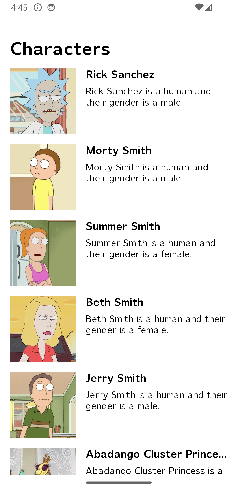
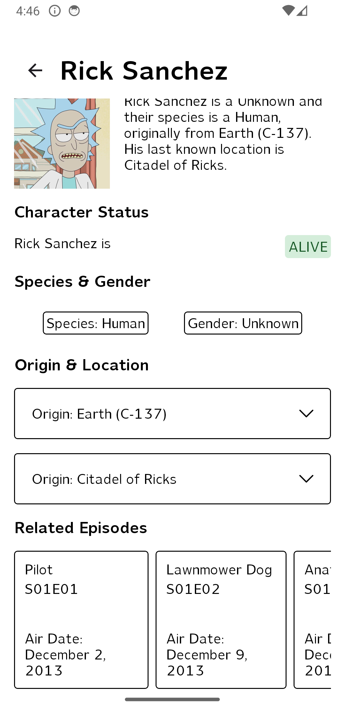

# Showcase app using Rick&Morty API 
## Summary

This project is created to showcase my current "ideal application", with high emphasis on app structure and data flow.
(The last part with other words: I have not put a huge effort on UI.)

## Some screenshots
| Character List                             | Character Details 1                               |
|--------------------------------------------|---------------------------------------------------|
|  |  |

## Screen Recording

[!showcase_app.webm](videos/showcase_app.webm)

## Dependencies
To define 3rd party libraries and dependencies in one place I used version catalogs.

Version Catalog dependency management uses a toml file to declare all 3rd party dependencies in one 
place, and makes it easy to share common dependencies between modules.

Read more at: https://docs.gradle.org/current/userguide/platforms.html

## Build Logic
To share build logic I chose to use [Convention Plugins](https://docs.gradle.org/current/samples/sample_convention_plugins.html).

This solution enables sharing common patterns - such as injection of the same subset of dependencies
into modules, making module gradle files lean and concise. As the project mainly contains "core" and
"feature" modules, and respectively they need a different subset of dependencies, it makes sense to 
use convention plugins and just apply the core/feature one on the core/feature modules.
There are some which are commonly used - such as Hilt - so that's separated out into its own CP.

## Modularisation
The app is structured into 2 main module groups:
- core
- feature

On top of these sits the app module that is using the feature modules to connect the dots. 
With this separation of concerns, each module is responsible for its own set of functionality. 

Core modules are technical modules, providing core functionality for the feature modules. 
This enables separation of concerns: if a module needs networking then it depends on the `:network`
module, otherwise no. In this simple example all modules at the moment needs it, but it can happen, 
that for example a future `:settings` module does not need it. (Prepared for scalability)

Feature modules are vertical slices of the app - right now it's just the list of characters,
and the character details. 

This kind of modularization enables scalability, and easier integration of new modules 
and modification of old modules, as parallel working engineers would not have that many merge conflicts.

## Internal module structure
Every module adopts the data/domain/presentation structure with packaging them separately, 
this ensures the separation of concerns, such as API level classes and objects are packaged in data,
domain package contains repositories, usecases, every internal entities/models and all business logic,
finally presentation layer contains presentation related classes and object: ViewModels, Composable 
functions and data classes that are used to represent data presented on the view.

In addition to these data/domain/presentation packages, API/Internal/View data classes are packaged
into `model` package. 

## App Architecture and data flow
The app follows an MVVM/MVI style of architecture: 
- the API calls are simple suspended functions that are using API models,
- these are used by the Repositories - where mapping to internal representation happens via mappers,
- ViewModels calls the repositories for data and update the state of the view. 
- Each ViewModel has a "state" which Views are subscribed to, 
- when this state in the VM changes it triggers a view recomposition.
- Views are only interacting with the ViewModel through the `onViewAction` function.
